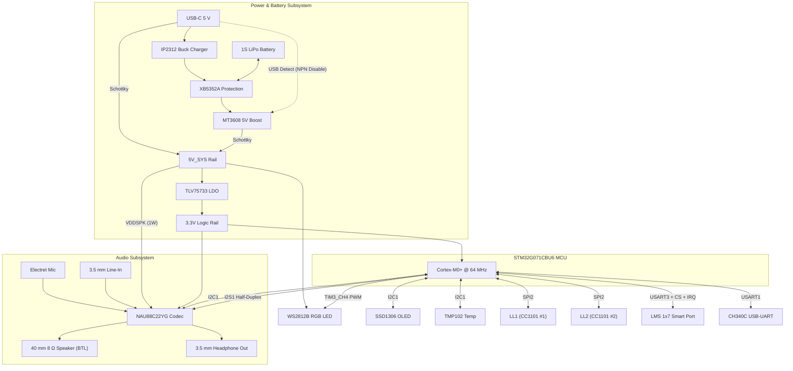

<p align="center">
  <h1 align="center">Lyrion Core G0</h1>
  <p align="center">
    STM32G071CBU6 Voice &amp; Audio Development Board<br>
    NAU88C22 audio codec with I2S half-duplex voice, electret microphone, 40 mm speaker, switched 3.5 mm line-in/line-out jacks, dual Lyrion Link radio sockets, LMS smart expansion port, 4-button OLED UI, and integrated LiPo battery management with dynamic power-path.
  </p>
</p>

<p align="center">
  <a href="#status--roadmap"></a>
  <a href="#core-hardware"></a>
  <a href="#audio-subsystem"></a>
  <a href="#lyrion-link-ports"></a>
  <a href="#license"></a>
</p>

---

## Table of Contents

1. [What is it?](#what-is-it)
2. [Key Features](#key-features)
3. [System Overview](#system-overview)
4. [Core Hardware](#core-hardware)
5. [Audio Subsystem](#audio-subsystem)
6. [Radio & Smart Module Ports](#radio--smart-module-ports)
7. [Display, UI & Expansion](#display-ui--expansion)
8. [Power & Battery Management](#power--battery-management)
9. [Firmware](#firmware)
10. [Design Decisions](#design-decisions)
11. [Status & Roadmap](#status--roadmap)
12. [License](#license)

---

## What is it?

Lyrion Core G0 is the Pro-tier member of the Lyrion Core family — a development board built around the STM32G071CBU6 (Cortex-M0+ @ 64 MHz, 128 KB flash, 36 KB RAM). Where the [Lyrion Core C0](https://github.com/oliskcz/Lyrion-Core-C0) is the compact leaf-node radio board, the G0 adds the capabilities the C0 cannot do: digital audio capture and playback, a dedicated 4-button menu interface, dual CC1101 sockets, an LMS smart module port, and portable battery operation with hardware power-path switching.

The board serves as the primary voice and telemetry node of the Lyrion ecosystem: an analog electret microphone, a Nuvoton NAU88C22YG audio codec, and a 40 mm speaker turn it into a push-to-talk (PTT) voice terminal. Two switched 3.5 mm jacks (line-in and headphone/line-out) provide external audio routing with automated hardware insertion detection.

---

## Key Features

| Feature | Specification |
|---|---|
| MCU | STM32G071CBU6, Cortex-M0+ @ 64 MHz, 128 KB flash, 36 KB RAM, UFQFPN-48 |
| Audio codec | Nuvoton NAU88C22YG — 24-bit stereo ADC/DAC, BTL speaker driver (1 W / 8 Ω), headphone driver, I2S + I2C |
| Microphone | INGHAi GMI9745P-30dB electret condenser, differential input via codec PGA + MICBIAS |
| Speaker | XHXDZ 40 mm, 8 Ω, 2 W — case-mounted, driven directly by codec BTL output |
| Audio jacks | 3.5 mm stereo input (line-in, codec LLIN/RLIN) + 3.5 mm stereo output (headphone/line-out, codec LHP/RHP) with switched jack-detect inputs (PC7 / PC13) |
| Display | 0.96" SSD1306 OLED 128×64 on 4-pin I2C1 header @ 0x3C (1.3" SH1106 option) |
| Sensors | TMP102 temperature sensor on I2C1 @ 0x49 |
| Radio sockets | LL1 + LL2 raw CC1101 sockets on shared SPI2 bus (PA0, PB14, PB15) + discrete CS and GDO lines |
| Smart port | LMS (Lyrion Smart Port standard) 1x7 2.54 mm header (5V, 3.3V, GND, TX, RX, CS, IRQ) |
| UI controls | 4-button OLED navigation matrix (UP PB8, DOWN PB9, OK PA15, BACK PC14) + dedicated PTT button (PA1) |
| Indicators | Discrete LED1 (PC0), LED2 (PC1), and 1x addressable WS2812B RGB LED (PB1, TIM3_CH4 + DMA1) |
| Expansion headers | Spare UART (USART2), Spare I2C (I2C2), Spare SPI (with CS_SPARE), and ADC / DAC header (2x DAC, 2x ADC) |
| Battery management | IP2312-4V35 buck charger (1A/1.5A/3A solder bridges, NTC), XB5352A 1S LiPo protection IC |
| Power-path | Dynamic load sharing: MT3608 5V boost converter automatically disabled on USB connection; 5V_SYS powered from USB 5V or battery |
| Logic regulation | TLV75733PDBVR low-dropout regulator fed by 5V_SYS for rock-solid 3.30V logic rail |
| Fuel gauge | 2:1 precision resistive divider from VBAT into PB12 (ADC1_IN16) |
| Console & debug | CH340C USB-UART on USART1 (PA9/PA10), 5-pin 2.54 mm SWD header with NRST |

---

## System Overview



---

## Core Hardware

### MCU — STM32G071CBU6

- Cortex-M0+ @ 64 MHz, 128 KB flash, 36 KB RAM (32 KB with parity), UFQFPN-48 (7 × 7 mm)
- Single I2S instance (I2S1, on SPI1) for digital audio
- 2x SPI, 2x I2C, 4x USART + 1x LPUART, 2x 12-bit DAC, 17x 12-bit ADC channels
- 44 usable GPIOs with fully conflict-free EXTI line mapping
- External 12.288 MHz audio crystal on PF0/PF1 for exact 48 kHz audio clocking

---

## Audio Subsystem

### Digital Audio Architecture (Half-Duplex PTT)

The board operates in half-duplex push-to-talk mode over I2S1:
- Playback: MCU operates as I2S master TX at 48 kHz, driving the codec DAC.
- Capture: MCU operates as I2S slave RX, sampling the codec ADC.
- Shared SD Pin: Both DACIN and ADCOUT are tied to PB5 (I2S1_SD), with codec register power gating ensuring only one path drives the net at any time.

### Transducers & Connectivity

- Onboard Microphone: INGHAi GMI9745P-30dB electret condenser mic wired differentially to MIC1P/MIC1N with 2.2k pull-up to MICBIAS.
- Loudspeaker: Case-mounted 40 mm 8 Ω 2 W driver powered by the codec differential BTL amplifier at 5V VDDSPK (~1W output).
- Line-In Jack (J_IN): Switched 3.5 mm TRS stereo jack wired through AC-coupling capacitors to LLIN/RLIN. Mechanical switch pulls PC7 low when plugged in.
- Headphone/Line-Out Jack (J_OUT): Switched 3.5 mm TRS stereo jack driven by codec LHP/RHP. Mechanical switch pulls PC13 low when plugged in, allowing firmware to auto-mute the speaker.

---

## Radio & Smart Module Ports

- LL1 Socket: Raw CC1101 socket on shared SPI2 (PA0=SCK, PB14=MISO, PB15=MOSI) + CS1 (PA8) + GDO0_1 (PA11, EXTI11) + GDO2_1 (PA12).
- LL2 Socket: Raw CC1101 socket on shared SPI2 + CS2 (PC6) + GDO0_2 (PB2, EXTI2) + GDO2_2 (PB10).
- LMS (Lyrion Smart Port standard): 1x7 2.54 mm header:
  - Pin 1: 5V
  - Pin 2: 3.3V
  - Pin 3: GND
  - Pin 4: TX (PC4, USART3_TX)
  - Pin 5: RX (PC5, USART3_RX)
  - Pin 6: CS (PC2, LMS_CS)
  - Pin 7: IRQ (PC3, LMS_IRQ, EXTI line 3)

---

## Display, UI & Expansion

- 4-Button OLED Navigation Matrix:
  - UP: PB8 (EXTI line 8)
  - DOWN: PB9 (EXTI line 9)
  - OK: PA15 (EXTI line 15)
  - BACK: PC14 (EXTI line 14)
- PTT Button: PA1 (EXTI line 1).
- OLED Display Header: 4-pin 2.54 mm header on I2C1 (PB6=SCL, PB7=SDA, 3.3V, GND).
- Temperature Sensor: Onboard Texas Instruments TMP102 on I2C1 (address 0x49 or 0x48).
- Indicators: LED1 (PC0), LED2 (PC1), and 1x WS2812B RGB LED on PB1 (TIM3_CH4 PWM + DMA1).
- Spare UART Header (1x4): 3.3V, TX (PA2, USART2), RX (PA3, USART2), GND.
- Spare I2C Header (1x4): 3.3V, SCL (PB13, I2C2), SDA (PB11, I2C2), GND.
- Spare SPI Header (1x6): 3.3V, GND, SCK (PA0), MISO (PB14), MOSI (PB15), CS_SPARE (PC15).
- ADC / DAC Header (1x4): DAC1_OUT1 (PA4), DAC1_OUT2 (PA5), ADC1_IN6 (PA6), ADC1_IN7 (PA7).

---

## Power & Battery Management

- Battery Charger: Injoinic IP2312-4V35 synchronous buck charger with solder bridges (1A / 1.5A / 3A) and battery NTC thermistor input.
- Battery Protection: XB5352A monolithic 1S LiPo protection IC (2.8V cutoff, 4.28V overcharge, short-circuit clamp).
- Boost Converter: MT3608 1.2 MHz boost converter stepping VBAT up to 5.0V.
- Dynamic Power-Path (Load Sharing):
  - USB 5V turns on an NPN transistor that pulls the MT3608 EN pin low when USB is connected (zero battery drain/cycling).
  - System 5V rail (5V_SYS) is powered directly from USB 5V (via Schottky diode) when plugged in, and MT3608 when on battery.
- Logic LDO: TLV75733PDBVR powered from 5V_SYS, guaranteeing steady 3.30V logic rail without dropout.
- Speaker Supply: VDDSPK powered by 5V_SYS, delivering full 1W speaker power in both USB and battery modes.
- Battery Fuel Gauge: 2x 100k precision resistive divider from VBAT into PB12 (ADC1_IN16).

---

## Firmware

The firmware follows the Core C0 layout (STM32CubeIDE + HAL, CubeMX-generated skeleton, hand-written drivers):

```
Lyrion-Core-G0/
├── Core/
│   ├── Inc/       config.h  g0_pinmap.h  main.h  stm32g0xx_hal_conf.h  stm32g0xx_it.h
│   ├── Src/       main.c (TODO)  stm32g0xx_hal_msp.c  stm32g0xx_it.c  ...
│   └── Startup/   startup_stm32g071xx.s
├── Drivers/
│   ├── Audio/     audio.c/.h          — I2S half-duplex engine (playback/capture/beep)
│   ├── CC1101/    cc1101.c/.h, cc1101_port.c/.h — radio driver (2 instances)
│   ├── CMSIS/     Cortex-M0+ headers
│   ├── Crypto/    aes128, ccm          — AES-128-CCM for Lyrion Link
│   ├── LyrionLink/                     — protocol: packet, MAC, network, security
│   ├── NAU88C22/  nau88c22.c/.h        — codec init, paths, volume, mic gain
│   ├── OLED/      ssd1306.c/.h         — display
│   ├── STM32G0xx_HAL_Driver/           — ST HAL
│   ├── TMP102/    tmp102.c/.h          — temperature sensor
│   └── WS2812B/   ws2812.c/.h          — addressable LED
├── docs/          SPECS.md  PINOUT.md  PLAN.md  CONNECTIONS.txt  REMAINING.md
├── STM32G071CBTX_FLASH.ld
└── README.md
```

Authoritative pin definitions live in [Core/Inc/g0_pinmap.h](Core/Inc/g0_pinmap.h) and [Core/Inc/main.h](Core/Inc/main.h), mirrored by [docs/PINOUT.md](docs/PINOUT.md) and [docs/CONNECTIONS.txt](docs/CONNECTIONS.txt).

---

## Design Decisions

1. NAU88C22YG Audio Codec: Stereo DAC, dual ADC paths, BTL speaker driver, and 3.5 mm headphone/line-in interfaces in a compact QFN-32 package.
2. Half-duplex PTT Audio: Sharing PB5 (I2S1_SD) between DACIN and ADCOUT matches voice radio operational needs while conserving pins and peripherals.
3. Dedicated SPI2 for Radios and SPI1 for Audio: Preserves full SPI bandwidth for Lyrion Link packets while I2S1 runs jitter-free audio streaming.
4. Dynamic Power-Path with MT3608 + TLV75733: Stepping battery voltage to 5.0V feeds the TLV75733 with plenty of headroom, avoiding 3.3V logic droop and powering the speaker at full 1W volume in portable operation.
5. LMS Smart Expansion Port: 1x7 header providing serial communications, power rails, chip select, and interrupt lines for high-speed companion coprocessors (ESP32, LoRa, GNSS).

---

## Status & Roadmap

| Phase | Description | Status |
|---|---|---|
| 0 | Architecture & pin assignment freeze, docs, firmware skeleton | Completed |
| 1 | Schematic capture in KiCad (IP2312, MT3608, NAU88C22, STM32G071) | In Progress |
| 2 | PCB layout (2-layer, solid ground return, filtered audio power) | Planned |
| 3 | Firmware bring-up (main.c, .ioc, clocks, UART, I2C, OLED, radios) | Planned |
| 4 | Audio bring-up (codec driver, beep, mic capture, PTT switching) | Planned |
| 5 | Lyrion Link Pro integration (protocol, AES-CCM, voice frames) | Planned |
| 6 | Enclosure design with 40 mm speaker gasket and battery bay | Planned |
| 7 | Field test: two G0 boards, PTT voice over 433 MHz | Planned |

---

## License

GNU General Public License v3.0 — see [LICENSE](LICENSE).

Copyright (c) 2026 Oliver Zoller.
