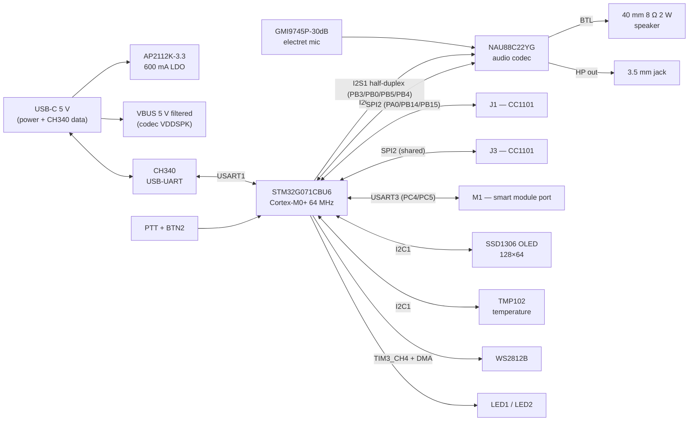

<p align="center">
  <h1 align="center">Lyrion Core G0</h1>
  <p align="center">
    <strong>STM32G071CBU6 Voice &amp; Audio Development Board</strong><br>
    NAU88C22 audio codec with I2S half-duplex voice, analog microphone and 40 mm speaker, multiple Lyrion Link module ports, OLED UI
  </p>
</p>

<p align="center">
  <a href="#status--roadmap"></a>
  <a href="#core-hardware"></a>
  <a href="#audio-subsystem"></a>
  <a href="#lyrion-link-ports"></a>
  <a href="#license"></a>
</p>

---

## Table of Contents

1. [What is it?](#what-is-it)
2. [Key Features](#key-features)
3. [System Overview](#system-overview)
4. [Core Hardware](#core-hardware)
5. [Audio Subsystem](#audio-subsystem)
6. [Lyrion Link Ports](#lyrion-link-ports)
7. [Display & User Interface](#display--user-interface)
8. [Power System](#power-system)
9. [Firmware](#firmware)
10. [Design Decisions](#design-decisions)
11. [Status & Roadmap](#status--roadmap)
12. [Known Limitations & Open Questions](#known-limitations--open-questions)
13. [License](#license)

---

## What is it?

Lyrion Core G0 is the **Pro-tier member of the Lyrion Core family** — a development board built around the **STM32G071CBU6** (Cortex-M0+ @ 64 MHz, 128 KB flash, 36 KB RAM). Where the [Lyrion Core C0](https://github.com/oliskcz/Lyrion-Core-C0) is the cheap leaf-node radio board, the G0 adds the things the C0 cannot do: **audio capture and playback**, a **real user interface**, and a **host port for smart Lyrion Link modules**.

The board is designed as the voice terminal of the Lyrion ecosystem: an analog electret microphone, a Nuvoton **NAU88C22** audio codec and a 40 mm speaker turn it into a push-to-talk (PTT) voice node, while two legacy CC1101 sockets and one M1 module port keep it compatible with the existing Lyrion Link radio modules.

It is **not** a Hi-Fi player and **not** a finished product. It is a bring-up platform for the STM32G0 series, I2S audio, half-duplex voice links, and the Pro build of the Lyrion Link protocol (mesh relay, file transfer, voice).

Target work covers STM32G0 bring-up, NAU88C22 codec experiments, PTT voice links over CC1101, Lyrion Link Pro protocol development, and the first hardware that can run the full Lyrion Link stack with audio.

---

## Key Features

| Feature | Specification |
|---------|---------------|
| **MCU** | STM32G071CBU6, Cortex-M0+ @ 64 MHz, 128 KB flash, 36 KB RAM, UFQFPN-48 |
| **Audio codec** | Nuvoton NAU88C22YG — 24-bit stereo ADC/DAC, BTL speaker driver (1 W / 8 Ω), headphone driver, I²S + I²C |
| **Microphone** | INGHAi GMI9745P-30dB electret condenser, differential input via codec PGA + MICBIAS |
| **Speaker** | XHXDZ 40 mm, 8 Ω, 2 W — case-mounted, driven from the codec BTL output |
| **Headphone** | 3.5 mm stereo jack on the codec headphone output (`ENABLE_HP_JACK`) |
| **Display** | 0.96" SSD1306 OLED 128×64 on I²C1 @ 0x3C (1.3" SH1106 drop-in option) |
| **Sensors** | TMP102 temperature sensor on I²C1 @ 0x49 |
| **Lyrion Link ports** | J1 + J3 raw CC1101 sockets (shared SPI2), plus the M1 smart-module port (UART + CS + IRQ) |
| **User interface** | PTT button (PA1), second button (PA2), LED1/LED2 (PC0/PC1), WS2812B status LED (PB1, TIM3 + DMA) |
| **Console / debug** | CH340 USB-UART on USART1 (PA9/PA10) with ROM-bootloader entry, SWD header (PA13/PA14) |
| **Power** | USB-C 5 V input (power + CH340 serial), AP2112K 3.3 V LDO, filtered VBUS rail for the codec speaker supply |
| **Board** | 2-layer, through-hole module headers, ~100 × 70 mm class (TBD) |

---

## System Overview



### Block summary

| Block | Role |
|-------|------|
| **MCU** | Runs the Lyrion Link Pro stack, audio engine, UI and all drivers |
| **Codec** | Single-chip voice front end: mic PGA + ADC, DAC + BTL speaker amp, headphone amp |
| **Radio ports** | Two raw CC1101 sockets (legacy, shared SPI2) and one M1 module port (smart module with its own MCU) |
| **UI** | OLED for status/menus, PTT and second button, two plain LEDs and one addressable RGB LED |
| **Power** | USB-C powered; 3.3 V digital rail from an LDO; speaker rail taken from filtered VBUS for full BTL output |

---

## Core Hardware

### MCU — STM32G071CBU6

- Cortex-M0+ @ 64 MHz, 128 KB flash, 36 KB RAM (32 KB with parity), UFQFPN-48 (7 × 7 mm)
- **Single I2S instance** (I2S1, multiplexed on SPI1) — see [Audio Subsystem](#audio-subsystem)
- 2× SPI, 2× I²C (FM+), 4× USART + 1× LPUART, 2× 12-bit DAC, 17× 12-bit ADC channels
- No USB FS peripheral (UCPD only) — the USB-C connector carries power plus the CH340 USB-UART link
- HSI16 internal oscillator; no HSI48/CRS

### Audio codec — NAU88C22YG

- 24-bit stereo codec: 2× ADC (differential mic preamps + MICBIAS + PGA), 2× DAC
- BTL loudspeaker driver: 1 W into 8 Ω at 5 V (≈0.4 W at 3.3 V)
- Stereo headphone driver: 40 mW into 16 Ω
- I²S/PCM digital interface (slave or master), I²C control @ 0x1A
- QFN-32, 5 × 5 mm; analog supply 2.5–3.6 V, digital 1.65–3.6 V

### Clocking (UNVERIFIED)

The codec needs a 12.288 MHz MCLK for 48 kHz audio. The firmware skeleton currently selects the **PLL I2S** clock for I2S1 (`RCC_I2S1CLKSOURCE_PLL` in `stm32g0xx_hal_msp.c`); an alternative Rev A option is a **12.288 MHz audio-grade HSE crystal** feeding the I2S1 kernel clock directly. The exact configuration (and resulting MCLK accuracy) must be validated during Phase 1 — see [Known Limitations & Open Questions](#known-limitations--open-questions).

---

## Audio Subsystem

### Why the NAU88C22?

The board was specified with either the **NAU88C10YG** (mono, QFN-20) or the **NAU88C22YG** (stereo, QFN-32). Rev A uses the **NAU88C22YG** because it matches the existing firmware driver, adds a stereo DAC and headphone output (useful on a dev board), and keeps the same I²S + I²C interface as the C10. The C10 remains the documented cost-down option for a future mono revision.

| | NAU88C10YG | NAU88C22YG (Rev A) |
|---|---|---|
| Package | QFN-20, 4 × 4 mm | QFN-32, 5 × 5 mm |
| ADC / DAC | 1 / 1 (mono) | 2 / 2 (stereo) |
| Mic inputs | 1 differential + PGA | 2 differential + PGA |
| BTL speaker | 1 W / 8 Ω @ 5 V | 1 W / 8 Ω @ 5 V |
| Headphone | 40 mW / 16 Ω | 40 mW / 16 Ω |
| Sample rate | 8–48 kHz | 8–192 kHz |
| LCSC | C914208 | C914209 |

### Half-duplex I²S (PTT)

The STM32G071 exposes **one I²S peripheral**, and the STM32G0 HAL supports only half-duplex modes (`MASTER_TX` / `SLAVE_RX` / etc.). Lyrion Core G0 therefore runs **PTT-style half-duplex audio**:

- **Playback** — MCU is I²S **master TX** at 48 kHz, DMA double-buffered (`audio_play_pcm`, `audio_beep`).
- **Capture** — MCU is I²S **slave RX**; the codec drives BCLK/FS (`audio_capture_start`).
- `audio_set_mode()` switches direction and calls `nau88c22_select_path()`, which powers down the unused path so the shared `I2S1_SD` net is always driven by exactly one side.

The codec's `DACIN` and `ADCOUT` are both wired to **PB5** (`I2S1_SD`); BCLK = PB3, FS = PB0, MCLK = PB4.

### Microphone

- **INGHAi GMI9745P-30dB** electret condenser, 9.7 × 4.5 mm, sensitivity −30 dB (0 dB = 1 V/Pa)
- Bias from the codec **MICBIAS** through a 2.2 kΩ resistor; AC-coupled into the differential **MIC1±** input
- Gain set in software via the codec PGA (`nau88c22_set_mic_gain`, 0.5 dB/step)
- Optional external mic header on the PCB (TBD)

### Speaker and headphone

- **XHXDZ 40 mm, 8 Ω, 2 W** full-range driver, mounted in the case, connected through a 2-pin connector
- Driven directly by the codec BTL output — 1 W at 5 V `VDDSPK`, ≈0.4 W at 3.3 V; adequate for voice, not for loud music
- Stereo 3.5 mm jack on the codec headphone output (enabled by `ENABLE_HP_JACK`)

---

## Lyrion Link Ports

The G0 exposes **three Lyrion Link module ports**:

| Port | Type | Interface | Pins |
|------|------|-----------|------|
| **J1** | Raw CC1101 socket | SPI2 (shared) + CS1 + GDO0/GDO2 | PA8, PA11, PA12 |
| **J3** | Raw CC1101 socket | SPI2 (shared) + CS2 + GDO0/GDO2 | PC6, PB2, PB10 |
| **M1** | Smart module port | USART3 + CS3 + IRQ | PC4, PC5, PC2, PC3 |

- J1 and J3 are the same **2.54 mm through-hole sockets** used on the Core C0, wired to the shared SPI2 bus (PA0 = SCK, PB14 = MISO, PB15 = MOSI). There is **no reset line** — the CC1101 is reset with the SRES strobe, as on the C0.
- The **M1 port** targets the Lyrion Link M1 smart modules (CC1101 + their own MCU) over UART, with a chip-select and an interrupt line for future SPI-based modules.
- See [`docs/PINOUT.md`](docs/PINOUT.md) for the full connector pinouts and [`docs/CONNECTIONS.txt`](docs/CONNECTIONS.txt) for the master net list.

---

## Display & User Interface

| Item | Details |
|------|---------|
| **OLED** | 0.96" SSD1306 128×64, I²C1 @ 0x3C, `Drivers/OLED/ssd1306.c` |
| **Temperature** | TMP102 @ 0x49, `Drivers/TMP102/tmp102.c` |
| **PTT button** | PA1, EXTI (line 1) — push-to-talk for voice |
| **BTN2** | PA2, EXTI (line 2) — **conflict: shares EXTI line 2 with GDO0_2 (PB2), see open questions** |
| **LED1 / LED2** | PC0 / PC1, plain status LEDs |
| **WS2812B** | PB1, TIM3_CH4 + DMA1 — RGB status / notifications |

---

## Power System

| Rail | Source | Consumers |
|------|--------|-----------|
| **VBUS 5 V** | USB-C receptacle (5.1 kΩ CC pulldowns) | Codec `VDDSPK` (filtered + bulk 470 µF), LDO input, CH340 |
| **3V3** | AP2112K-3.3, 600 mA LDO | MCU, codec digital/analog, OLED, TMP102, CC1101 modules, WS2812B |
| **Codec VDDSPK** | Filtered VBUS | BTL speaker driver only |

Rough 3V3 budget: MCU ≈ 15 mA, codec ≈ 15 mA, OLED ≈ 20 mA, TMP102 ≈ 1 mA, CH340 ≈ 10 mA, WS2812B ≤ 60 mA, two CC1101 modules ≤ 100 mA in TX — well within the 600 mA LDO. The speaker draws its peaks from VBUS, not the LDO.

The G071 itself has no USB peripheral, so the USB-C connector carries power **and** the CH340 USB 2.0 full-speed link; the CH340 exposes USART1 as the console and ROM-bootloader port. Flashing is possible over the CH340 or the SWD header.

---

## Firmware

The firmware follows the Core C0 layout (STM32CubeIDE + HAL, CubeMX-generated skeleton, hand-written drivers):

```
Lyrion-Core-G0/
├── Core/
│   ├── Inc/       config.h  g0_pinmap.h  main.h  stm32g0xx_hal_conf.h  stm32g0xx_it.h
│   ├── Src/       main.c (TODO)  stm32g0xx_hal_msp.c  stm32g0xx_it.c  ...
│   └── Startup/   startup_stm32g071xx.s
├── Drivers/
│   ├── Audio/     audio.c/.h          — I2S half-duplex engine (playback/capture/beep)
│   ├── CC1101/    cc1101.c/.h, cc1101_port.c/.h — radio driver (2 instances)
│   ├── CMSIS/     Cortex-M0+ headers
│   ├── Crypto/    aes128, ccm          — AES-128-CCM for Lyrion Link
│   ├── LyrionLink/                     — protocol: packet, MAC, network, security
│   ├── NAU88C22/  nau88c22.c/.h        — codec init, paths, volume, mic gain
│   ├── OLED/      ssd1306.c/.h         — display
│   ├── STM32G0xx_HAL_Driver/           — ST HAL
│   ├── TMP102/    tmp102.c/.h          — temperature sensor
│   └── WS2812B/   ws2812.c/.h          — addressable LED
├── docs/          SPECS.md  PINOUT.md  PLAN.md  CONNECTIONS.txt  REMAINING.md
├── STM32G071CBTX_FLASH.ld
└── README.md
```

Feature toggles live in `Core/Inc/config.h` (`ENABLE_UART1`, `ENABLE_WS2812`, `ENABLE_OLED`, `ENABLE_I2C`, `ENABLE_TMP102`, `ENABLE_SPI`, `ENABLE_CC1101`, `ENABLE_AES`, `ENABLE_AUDIO`, `ENABLE_CODEC`, `ENABLE_HP_JACK`, `CC1101_ENABLE_RADIO1/2`, `LL_*`). The authoritative pin map is [`Core/Inc/g0_pinmap.h`](Core/Inc/g0_pinmap.h), mirrored by [`docs/PINOUT.md`](docs/PINOUT.md).

**Build:** open in STM32CubeIDE (or import the CubeMX project once `STM32_Lyrion_Core_G0.ioc` exists) and build. `main.c` and the `.ioc` are the two missing pieces — tracked in [`docs/REMAINING.md`](docs/REMAINING.md).

---

## Design Decisions

### 1. NAU88C22YG (not the C10) for Rev A

The C10 is smaller and cheaper, but the C22 adds a second ADC/DAC, a headphone output and 192 kHz support for ~$0.23 more, and the existing codec driver already targets it. The C10 stays documented as the mono cost-down path.

### 2. Half-duplex PTT audio (one I²S)

The G071 has a single I²S and the G0 HAL has no full-duplex mode. Sharing `I2S1_SD` between `DACIN` and `ADCOUT` and switching direction in software is the only way to get mic + speaker on this MCU without an external switch — and PTT is the natural mode for a voice radio node anyway.

### 3. SPI2 for the radios, SPI1 for I²S

On the G0 the only I²S is I²S1 (on SPI1), so the radios must move to SPI2. This is the main pin-map difference from the C0 (which uses SPI1 for both CC1101 sockets).

### 4. CH340 USB-UART (no native USB)

The STM32G071 has no USB FS peripheral (only UCPD), so USB data would need a bridge anyway. A CH340 on USART1 gives console + ROM-bootloader flashing with no extra MCU complexity; the USB-C connector therefore carries both power and the CH340 data link.

### 5. 5 V speaker rail from VBUS

The codec BTL driver only reaches 1 W into 8 Ω with a 5 V `VDDSPK`. Taking it from filtered VBUS (with bulk capacitance) avoids a boost converter and keeps the 3.3 V LDO cool.

---

## Status & Roadmap

| Phase | Description | Status |
|-------|-------------|--------|
| 0 | Repo, docs, pin map, firmware skeleton | ✅ Done |
| 1 | Schematic capture, clocking validation, EXTI conflict fix | ⏳ Planned |
| 2 | PCB layout (2-layer, audio grounding, speaker connector) | ⏳ Planned |
| 3 | Firmware bring-up (main.c, .ioc, clocks, UART, I²C, OLED, radios) | ⏳ Planned |
| 4 | Audio bring-up (codec, beep, mic capture, PTT switching) | ⏳ Planned |
| 5 | Lyrion Link Pro integration (protocol, AES-CCM, voice frames) | ⏳ Planned |
| 6 | Enclosure with case-mounted 40 mm speaker | ⏳ Planned |
| 7 | Field test: two G0 boards, PTT voice over 433 MHz | ⏳ Planned |

See [`docs/PLAN.md`](docs/PLAN.md) for the detailed phase-by-phase plan.

---

## Known Limitations & Open Questions

- **`main.c` and `STM32_Lyrion_Core_G0.ioc` do not exist yet** — the firmware skeleton cannot build until Phase 3.
- **EXTI conflict (fixed in skeleton):** BTN2 originally shared EXTI line 2 with GDO0_2 (PB2). BTN2 is now on **PA5** (EXTI line 5) in `main.h`/`g0_pinmap.h`; keep the CubeMX `.ioc` in sync when it is created.
- **Clock tree unverified:** 12.288 MHz MCLK generation for the codec (PLL I²S as implemented vs HSE crystal option) must be validated in Phase 1.
- **BOOT0 is on PA14** (shared with SWCLK) and **PF2 is NRST** on this package — the CH340 auto-download circuit must strap the correct pins.
- **PB3 is I²S1_CK and also SWO** — SWD works, SWO tracing does not.
- **M1 module pinout unverified:** confirm the physical connector against the `LyrionMIVTwo.zip` module archive before committing the footprint.
- **Speaker output power** is 1 W (5 V) into the 8 Ω / 2 W speaker — fine for voice, not for loud playback.
- **License headers:** driver files carry MIT SPDX headers while the repo is GPL-3.0; align before release.
- **2-layer audio layout** requires care (solid ground plane, short analog traces, separated digital return) — no dedicated analog layer on Rev A.

---

## License

GNU General Public License v3.0 — see [LICENSE](LICENSE).

Copyright (c) 2026 Oliver Zoller.
